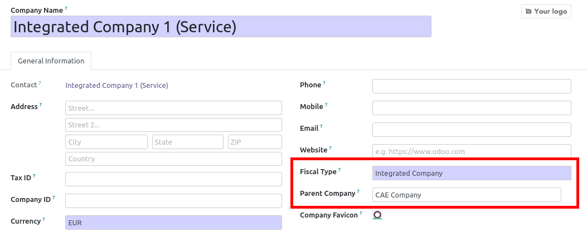

This module extend Odoo functionnalities, regarding companies features to
manage CAE (Coopearatives of Activities and Employment) that is a special
status for french companies.

(see above, links that describes what is CAE).

Basically, in a CAE, there is a 'parent' company that hosts many 'child'
companies. People in a child company should have access only to their activity.
(account moves, customers, suppliers, products, etc...)

In a fiscal and legal point of view, there is only one company (the parent one)
so there is only on chart of accounts. Accounting moves of the child
companies are written in the child company, but associated to the account of
the parent company.

**Companies feature**

* Add a new field on company `fiscal_type`:
    * `group` : Container company: can only contains 'Normal'
      or 'CAE' Companies.
    * `normal` : Classical company, (by default)
    * `fiscal_mother`: CAE company, that can host many child companies
    * `fiscal_child`: child company, hosted by the CAE

**More information about CAE [FR]**

* https://fr.wikipedia.org/wiki/Coopérative_d'activités_et_d'emploi
* http://www.cooperer.coop/
* http://www.copea.fr/
